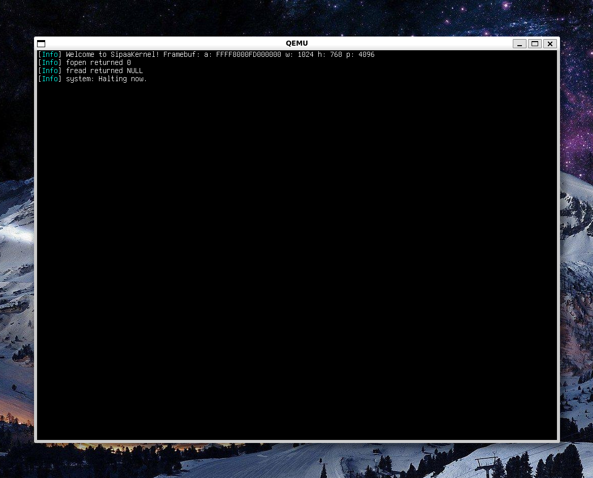

  
  
  
The modern, multi-architecture, elegant, easy-to-understand kernel.

## What is SipaaKernel?
SipaaKernel is a monolithic kernel made in C

It features an easy & elegant API.

## How it looks
At front-end, it just shows text, but at back-end, it does many things!

## Features
* Boot :
  * UEFI/BIOS support
  * Powered by Limine

* Kernel :
  * AArch64 architecture
  * x86-64 architecture
    * IDT / PIC / GDT / TSS (todo)
    * Serial console
  * Generic
    * Video terminal
    * Physical Memory Manager

## Q&A

### Why chosing C?
We choosed C to have an easy & elegant API for making the best OSes.

### Will it have a desktop environment & apps?
Nope, but you can make an OS with the SipaaKernel APIs.

## Credits
* Limine Contributors : The Limine bootloader & his protocol. (boot/limine*, kernel/src/boot/limine.h)
* The ZAP group : Font (ZAP Light 16, kernel/src/main.c: `uint8_t zap_light16[]`)
* Lolguy91 : CPU utils & FPU (kernel/src/arch/x86_64/cpu.c & .h)
* Kokolor : Terminal (kernel/src/lib/terminal.c/.h)